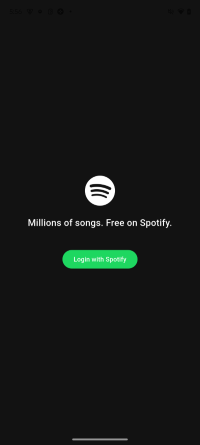

# Spotify Clone

## Description

I was given an internship assessment task from **Livewall** to create a simple Flutter application that allows logging in via the Spotify API and displays the data on different screens. The app allows users to look at their profile information and see their playlists, directly from their Spotify account. They can also see the tracks from each playlist and once they click on one of the tracks - another screen opens with the name(s) of the artist(s), album name and duration. I was instructed to determine the design myself, however I chose to follow the Spotify design guidelines and signature colors.

## Features

- Spotify Authorization Code with PKCE Flow
- Profile screen displaying user information and an overview of playlists
- Playlist view showing all tracks in a playlist
- Track detail view including:
    - Album artwork
    - Artist(s)
    - Album name 
    - Song duration

## Tech Stack

- **Framework:** Flutter (Dart)
- **HTTP Requests:** http package
- **Authentication:** OAuth2(via flutter_web_auth_2)

## Screenshots

1. **Login Screen**





2. **Profile Screen**


3. **Playlist Screen**


4. **Track Detail**


## Prerequisites

- **Flutter Installation:** Ensure Flutter is installed by following the instructions: https://docs.flutter.dev/get-started/install
- **Spotify Developer Account** with:
    - Client ID
    - Redirect URI
- **Android/IOS** emulator or physical device

## Setup and run locally 

1. **Clone the repository**
```bash
git clone https://github.com/marianakazakova469/internship_task.git
cd internship_task/spotify_app
```

2. **Install fFlutter dependencies**
```bash
flutter pub get
```

3. **Add your Spotify credentials** **(not needed for the assessment)**
```bash
const String clientId = 'YOUR_SPOTIFY_CLIENT_ID';
const String redirectUri = 'yourapp://callback';
```

4. **Update XML and PLINK files** **(not needed for the assessment)**
- For Android: Update AndroidManifest.xml
- For iOS: Update Info.plist

5. **Run the app** 
```bash
flutter run
```

## Acknowledgements
- [README editor](https://readme.so/editor)
- [Spotify Web API](https://developer.spotify.com/documentation/web-api)
